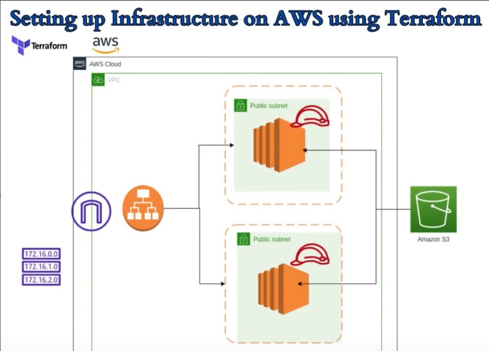

# AWS VPC Infrastructure with Terraform

A Terraform project that builds a complete AWS networking environment from scratch.

The project creates a custom VPC with public networking, deploys two Apache web servers across different Availability Zones, places them behind an Application Load Balancer, and provisions an S3 bucket.

---

## Architecture



---

## Infrastructure Created

### Networking

- Custom VPC (`10.0.0.0/16`)
- Two Public Subnets
- Internet Gateway
- Public Route Table
- Route Table Associations

### Compute

- Two EC2 (`t3.micro`) instances
- Apache automatically installed using User Data

### Load Balancing

- Application Load Balancer
- Target Group
- HTTP Listener (Port 80)

### Security

- Security Group allowing:
  - HTTP (80)
  - SSH (22)

### Storage

- Amazon S3 Bucket

---

## Architecture Overview

```text
                          Internet
                              │
                              ▼
                  Application Load Balancer
                   (HTTP Listener - Port 80)
                              │
                 Security Group (HTTP + SSH)
                              │
            ┌─────────────────┴─────────────────┐
            │                                   │
            ▼                                   ▼
      Public Subnet A                     Public Subnet B
      10.0.0.0/24                         10.0.1.0/24
      eu-north-1a                         eu-north-1b
            │                                   │
            ▼                                   ▼
        EC2 Web Server 1                  EC2 Web Server 2
        Apache Installed                  Apache Installed
            └────────────── Inside VPC ──────────────┘
                     Custom VPC (10.0.0.0/16)
                              │
                      Internet Gateway
                              │
                           Internet


             Amazon S3 Bucket
```

---

## How the Infrastructure Works

### 1. Custom VPC

The project creates its own VPC instead of using the AWS default VPC.

| Property | Value |
|----------|-------|
| CIDR | `10.0.0.0/16` |
| Region | `eu-north-1` |

This provides complete control over networking.

---

### 2. Public Subnets

Two public subnets are created in different Availability Zones.

| Subnet | CIDR | Availability Zone |
|--------|------|-------------------|
| Subnet 1 | `10.0.0.0/24` | `eu-north-1a` |
| Subnet 2 | `10.0.1.0/24` | `eu-north-1b` |

Both subnets automatically assign public IP addresses.

---

### 3. Internet Gateway

The Internet Gateway connects the VPC to the internet.

Without it:

- EC2 instances would not be reachable.
- The Application Load Balancer would not receive traffic.

---

### 4. Public Route Table

The route table sends internet traffic through the Internet Gateway.

| Destination | Target |
|-------------|--------|
| `10.0.0.0/16` | Local |
| `0.0.0.0/0` | Internet Gateway |

---

### 5. Route Table Associations

Each subnet is associated with the public route table, allowing both subnets to use the internet route.

---

## Security Group

The project creates a single Security Group named:

```
web-server-sg
```

It is attached to:

- Both EC2 instances
- The Application Load Balancer

### Inbound Rules

| Port | Purpose | Source |
|------|---------|--------|
| 22 | SSH | `0.0.0.0/0` |
| 80 | HTTP | `0.0.0.0/0` |

### Outbound Rules

- All traffic is allowed.

---

## EC2 Instances

Two Ubuntu EC2 instances are deployed.

| Instance | Subnet |
|----------|--------|
| Web Server 1 | Public Subnet A |
| Web Server 2 | Public Subnet B |

Both instances:

- use `t3.micro`
- install Apache during boot
- display their Instance ID on the webpage
- show which server handled the request

The user-data scripts (`userdata.sh` and `userdata1.sh`) automatically:

- update packages
- install Apache
- install AWS CLI
- create a custom `index.html`
- enable Apache at startup

Example webpage:

```text
Terraform Project Server 1
Instance ID: i-xxxxxxxx
Instance 1
```

The second server displays **Instance 2**.

---

## Application Load Balancer

The Application Load Balancer distributes incoming HTTP requests across both EC2 instances.

Configuration:

| Property | Value |
|----------|-------|
| Type | Application |
| Scheme | Internet-facing |
| Listener | HTTP (80) |
| Subnets | Both public subnets |

The ALB becomes the public entry point for the application.

---

## Target Group

The Target Group contains both EC2 instances.

Health Check:

| Property | Value |
|----------|-------|
| Protocol | HTTP |
| Path | `/` |
| Port | Traffic Port |

Only healthy instances receive traffic.

---

## Traffic Flow

```text
User
 │
 ▼
Internet
 │
 ▼
Application Load Balancer
 │
 ▼
Target Group
 │
 ├────────► Web Server 1
 │
 └────────► Web Server 2
```

Refreshing the page may show different Instance IDs depending on which server receives the request.

---

## Amazon S3 Bucket

The project also creates an S3 bucket.

| Property | Value |
|----------|-------|
| Bucket Name | `my-tf-test-bucket-kevin-now-okay` |
| Environment | Dev |

The bucket is provisioned independently of the VPC and can be used for:

- static assets
- backups
- logs
- future application storage

---

## Project Structure

```text
Project01/
├── architecture.png
├── main.tf
├── provider.tf
├── variables.tf
├── outputs.tf
├── userdata.sh
├── userdata1.sh
├── output.png
├── output(1).png
└── README.md
```

---

## Terraform Workflow

### Initialize

```bash
terraform init
```

Downloads the AWS provider and initializes Terraform.

---

### Preview Changes

```bash
terraform plan
```

Shows what Terraform will create before deployment.

---

### Deploy Infrastructure

```bash
terraform apply
```

Creates all AWS resources.

---

### Destroy Infrastructure

```bash
terraform destroy
```

Removes every resource created by Terraform.

---

## Outputs

Terraform exposes useful outputs after deployment.

| Output | Description |
|--------|-------------|
| `vpc_id` | Created VPC ID |
| `subnet_id_main1` | First subnet ID |
| `subnet_id_main2` | Second subnet ID |
| `loadbalancerdns` | Public ALB DNS Name |

Example:

```text
loadbalancerdns = myalb-xxxxxxxx.eu-north-1.elb.amazonaws.com
```

---

## Resources Created

| Resource | Count |
|----------|-------|
| Custom VPC | 1 |
| Public Subnets | 2 |
| Internet Gateway | 1 |
| Route Table | 1 |
| Route Associations | 2 |
| Security Group | 1 |
| EC2 Instances | 2 |
| Application Load Balancer | 1 |
| Target Group | 1 |
| Listener | 1 |
| S3 Bucket | 1 |

---

## AWS Concepts Learned

This project demonstrates several core AWS networking concepts.

- Infrastructure as Code with Terraform
- Custom VPC design
- CIDR planning
- Public subnet architecture
- Internet Gateway connectivity
- Route Tables and Associations
- Security Groups
- Multi-AZ deployment
- EC2 provisioning
- Apache automation with User Data
- Application Load Balancer
- Target Groups and Health Checks
- Amazon S3 storage
- Terraform outputs and infrastructure lifecycle

It provides a solid foundation before moving on to Private Subnets, NAT Gateways, Auto Scaling Groups, ECS, EKS, and multi-tier AWS architectures.
